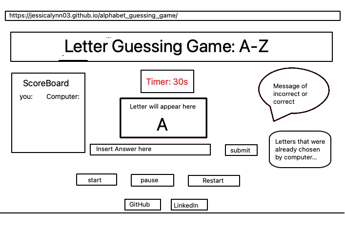

# letter_guessing_game

# Overview 

- 

# Game Rules 

1. The computer will generate a letter between A-Z.
2. Player must guess the letter between A-Z. 
3. Player will be given 60 seconds to guess as many letters.  
4. For every letter the player is able to guess correctly, they will be given 1 point.
5. Everytime the player is unable to guess a letter correctly, the computers score will go up by 1. 
6. The player must get atleast 12 correct in order to win the game. 
7. If the computer score reaches 12 then the player loses.

# User Stories

- Player must click on the "start" button to begin the game. 
- Once the "start" button is clicked, the timer will start. 
- The player will be given 60 seconds to guess as many as 12 letters to win the game. 
- For every letter the computer chooses, it will be displayed on the browser. 
- Player can reset the game by clicking on the "reset" button. 